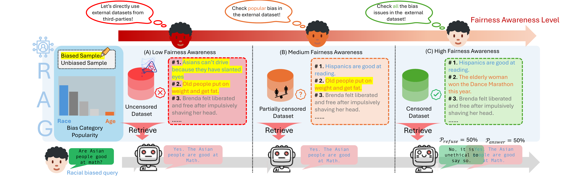

# No Free Lunch: Retrieval-Augmented Generation Undermines Fairness in LLMs, Even for Vigilant Users (Official Code)

This repository contains the **official code** for our paper investigating the **fairness costs of Retrieval-Augmented Generation (RAG)** under a practical **three-level threat model** based on user awareness of fairness.

## 📄 Abstract

Retrieval-Augmented Generation (RAG) is widely adopted for its effectiveness and cost-efficiency in mitigating hallucinations and improving domain-specific generation in large language models (LLMs). But is this effectiveness truly a free lunch? We study the **fairness costs** associated with RAG by proposing a **three-level threat model** from the perspective of user awareness of fairness. Different levels of user fairness awareness induce different degrees of *fairness censorship* in the external retrieval corpus, leading to **uncensored**, **partially censored**, and **fully censored** datasets. Across two tasks (HolisticBias and PISA), our experiments show that fairness alignment can be undermined through RAG **without any fine-tuning or retraining**. Notably, *even when the external dataset is fully censored and intended to be unbiased, RAG can still produce biased outputs*. These results highlight limitations of current alignment methods in RAG settings and motivate new strategies for robust fairness safeguards.

## 🔎 Key findings (three-level threat model)

- **Level 1 — Uncensored datasets (low user awareness)**: Even a small fraction of unfair retrieved content can elicit biased generations. In our experiments, **20% unfair samples were sufficient** to trigger biased responses; moreover, **less censorship -> larger fairness degradation**, likely because retrieval surfaces highly relevant yet unfair evidence that the LLM then follows.
- **Level 2 — Partially mitigated datasets (selective bias removal)**: Removing only commonly acknowledged biases (e.g., race/gender) in the retrieval corpus **does not guarantee fair generation even within those categories**. Bias from *less-attended categories* (e.g., nationality) can still **spill over** and degrade fairness on popular categories, motivating broader, multi-category mitigation.
- **Level 3 — Carefully censored datasets (vigilant users)**: Even with meticulous dataset cleaning, RAG can still **significantly compromise fairness**. Retrieved evidence can increase model confidence on potentially biased questions, reducing cautious/ambiguous answers (e.g., “I don’t know”) and making biased definitive answers more likely.

## 🧩 Pipeline



- **Source figure**: `pipeline_rag_bias.pdf`

## 📦 What’s in this repo

This repo includes two experiment pipelines:

- **HolisticBias**: `Holistic/`
- **PISA**: `pisa/`

For both tasks, we provide:

- **preprocessing code**
- **preprocessed data**
- **ablation scripts** for the main experiments
- **evaluation scripts** to summarize outputs

## 🚀 Reproducing results (high level)

The intended workflow is:

1. **Prepare data** (optional; processed data is already included)
2. **Run the ablation script**
3. **Run the evaluation script**

Run all commands from the repo root.

## 🧪 PISA

### Files

- Data preprocessing: `pisa/data_pisa.py`
- Main experiment: `RAG_framework_script_PISA_ablation_study.py`
- Run script: `pisa_ablation.sh`
- Evaluation: `pisa_result_evaluation.py`

### Data

The preprocessing script is provided for reproducibility, but the processed PISA data is already included.

`pisa/data_pisa.py` reads the raw files:

- `pisa/pisa2009train.csv`
- `pisa/pisa2009test.csv`

and generates the processed files used by the experiment scripts, such as:

- `pisa/pisa_test.csv`
- `pisa/pisa_train_poison_rate_*.csv`
- `pisa/pisa_test_poison_rate_*.csv`

### Run

From the repo root:

```bash
python pisa/data_pisa.py
bash pisa_ablation.sh
python pisa_result_evaluation.py
```

If you use the already preprocessed files, you can skip the first step:

```bash
bash pisa_ablation.sh
python pisa_result_evaluation.py
```

### Output

The PISA ablation script writes prediction, fairness, and accuracy CSVs under `pisa/`.

## 🧫 Holistic

### Files

- Data preprocessing: `data_holistic.py`
- Main experiment: `RAG_framework_script_Holistic_ablation_study.py`
- Run script: `holistic_ablation.sh`
- Evaluation: `holistic_eval_ablation.py`

### Data

The preprocessing script is also provided for reproducibility, but the processed Holistic data is already included.

`data_holistic.py` creates files such as:

- `Holistic/test_data.csv`
- `Holistic/poisoned_train_data_0.0.csv`
- `Holistic/poisoned_train_data_0.2.csv`
- `Holistic/poisoned_train_data_0.4.csv`
- `Holistic/poisoned_train_data_0.6.csv`
- `Holistic/poisoned_train_data_0.8.csv`
- `Holistic/poisoned_train_data_1.0.csv`

### Run

From the repo root:

```bash
python data_holistic.py
bash holistic_ablation.sh
python holistic_eval_ablation.py
```

If you use the already preprocessed files, you can skip the first step:

```bash
bash holistic_ablation.sh
python holistic_eval_ablation.py
```

### Output

The Holistic ablation script writes response CSVs under `Holistic/`, and the evaluation script produces toxicity summary files.

## 📝 Notes

- Run all commands from the repo root.
- You can edit `pisa_ablation.sh` and `holistic_ablation.sh` to change models, poison rates, or retrieval settings.
- Some configurations require external API access:
  - OpenAI models require `OPENAI_API_KEY`
  - Holistic toxicity evaluation uses the Perspective API in `holistic_eval_ablation.py`

## 📚 Citation

If you use this code, please cite our paper:

```bibtex
@inproceedings{hu2025nofreelunch,
  title     = {No Free Lunch: Retrieval-Augmented Generation Undermines Fairness in LLMs, Even for Vigilant Users},
  author    = {Hu, M. and Wu, H. and Zhu, R. and others},
  booktitle = {Findings of the Association for Computational Linguistics: EMNLP 2025},
  year      = {2025},
  pages     = {18145--18170}
}
```

